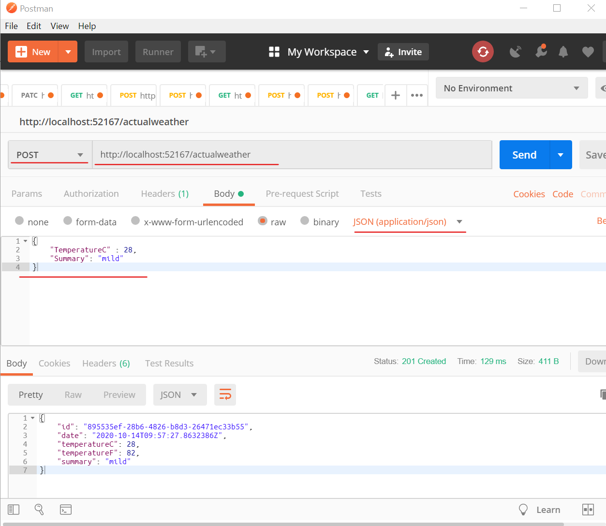
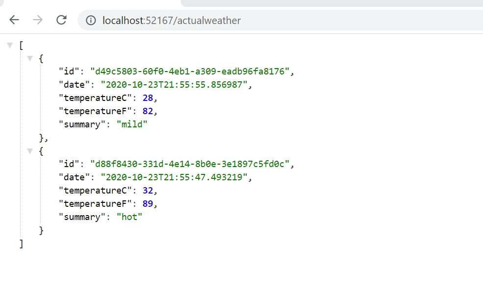
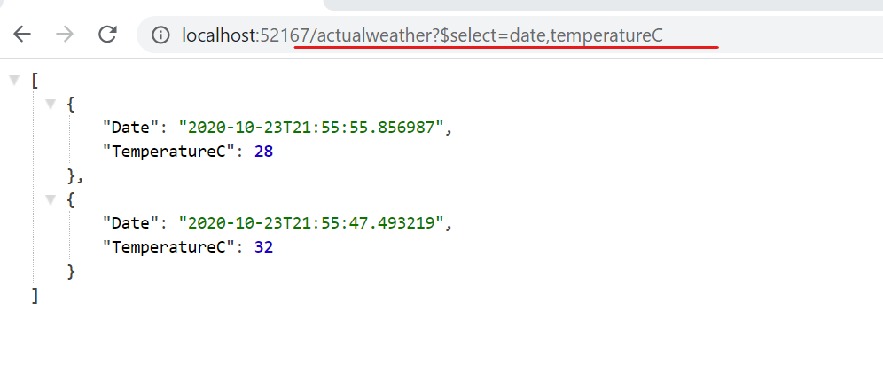
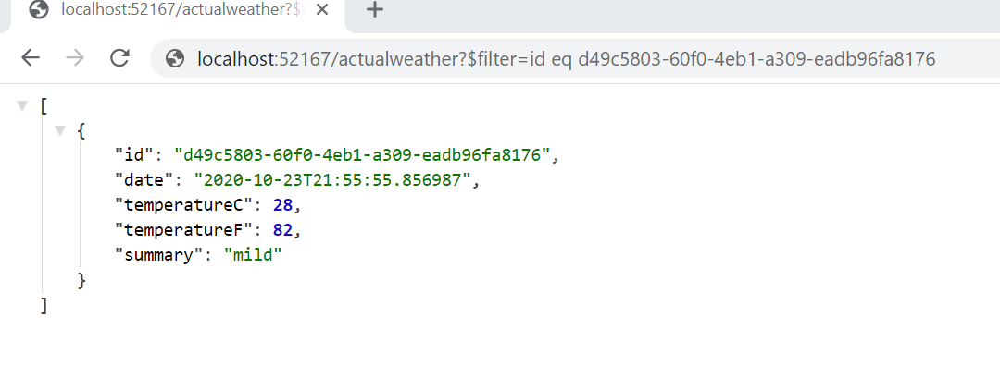

## CockroachDB To-Do App with C#, ASPNET.CORE 3.1 and Entity Framework core 

This app implements a sample IoT sink to receive weather information and feed it back via an API endpoint.


Inorder to run the app succesfully, fulfil the following pre-requisites:-
1. [.Net core 3.1](https://dotnet.microsoft.com/download/dotnet-core/3.1)

2. Visual studio 2019!

3. A local `insecure` CockroachDB cluster listening on port `26257`. One may follow these [instructions](https://www.cockroachlabs.com/docs/stable/install-cockroachdb-windows.html). 

4. Create the database and table with the following scripts

```
CREATE DATABASE weather;

CREATE TABLE weather_entries
(
id UUID NOT NULL PRIMARY KEY,
date TIMESTAMP NOT NULL DEFAULT CURRENT_TIMESTAMP,
temperature_c INT,
summary VARCHAR(50)
);
```

## Running

Running the application loads the browser on the endpoint `/actualweather` but returns no data.

## Input

Using POSTMAN or any of your favourite web api client submit a POST request with the following requirements
 - content-type -> `application/json`
 - body ->  as below

 ```
 {
	"TemperatureC" : 28,
	"Summary": "mild"
}
 ```
Using POSTMAN my setup looks like:


## OData

The latest version of the TO-DO app now supports [OData](https://www.odata.org/) natively. All HTTP requests are now queryable providing support for all OData operations. This support is implemented from the query string parameters down to the Entiy framework SQL query that is generated and sent to the Cockroach DB database.  

Running the default request all the rows as shown:


Modifying the request to pull only the `date` and `temperatureC` data points.


As a matter of fact, you may as well simply query a specific entry. Assuming the model was a representation of customer accounts or devices, we can query a specific entry by the `id` as follows



For a full range of operations supported by OData, please refer to the [OData Docs](https://www.odata.org/documentation/)

** The url has been edited for readability. The final request needs to be url encoded before making the request.