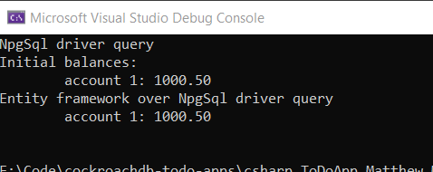

## CockroachDB To-Do App using C# and Entity framework

This app implements the functionality to query a database on CockroachDB using Entity framework. 

Inorder to run the app succesfully, fulfil the following pre-requisites:-

1. [.Net core 3.1](https://dotnet.microsoft.com/download/dotnet-core/3.1)

2. Visual studio 2019!

2. A local `insecure` CockroachDB cluster listening on port `26257`. One may follow these [instructions](https://www.cockroachlabs.com/docs/stable/install-cockroachdb-windows.html). 

3. The sample `bank` data used in this [tutorial](https://www.cockroachlabs.com/docs/stable/start-a-local-cluster-in-docker-mac.html#step-3-use-the-built-in-sql-client), i.e step 3

4. The packages below

```
    install-package Microsoft.EntityFrameworkCore -version 3.1.8
	install-package Npgsql.EntityFrameworkCore.PostgreSQL -version 3.1.3
```

## Output
Running the app gives the following console output




## To Do

This is still a very basic way of using using Entity framework to access CockroachDB. There are opportunities to expand this example to capture the extend of support provided by the ORM such as:-

 - Handling Db Migrations
 - Complex types
 
  
