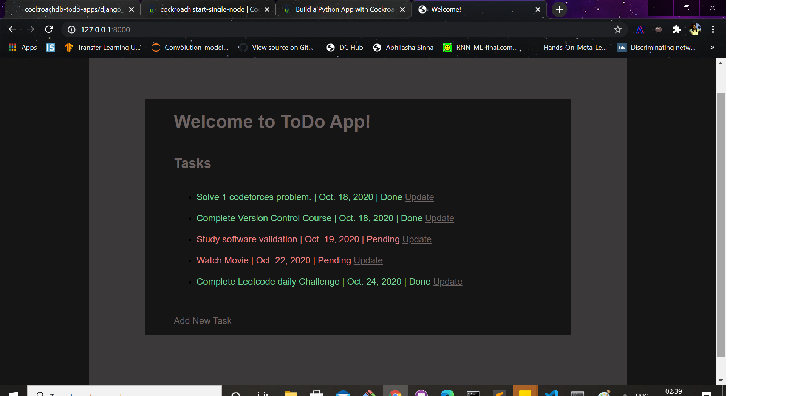
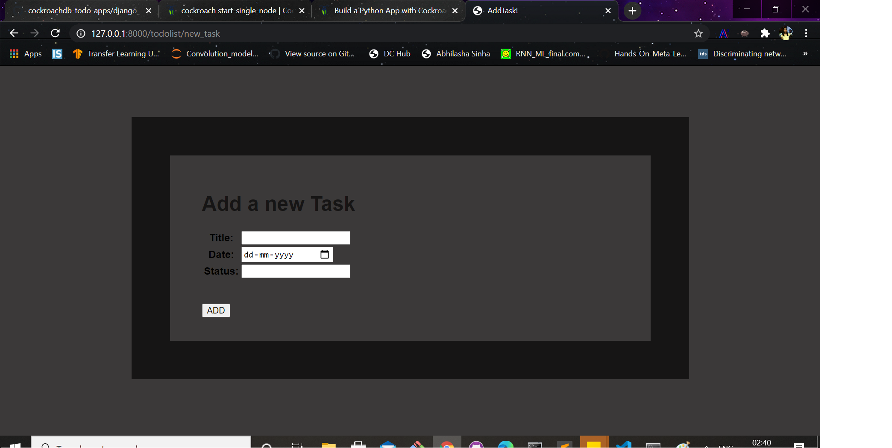
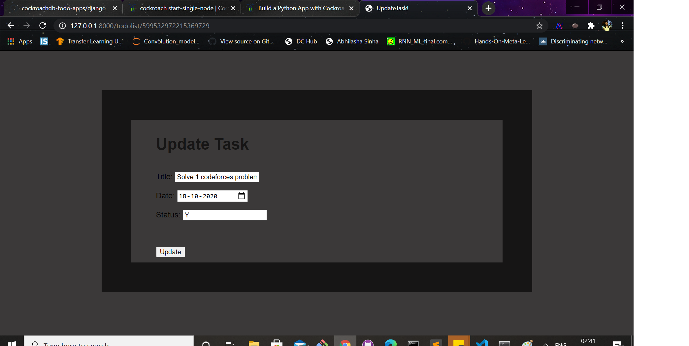
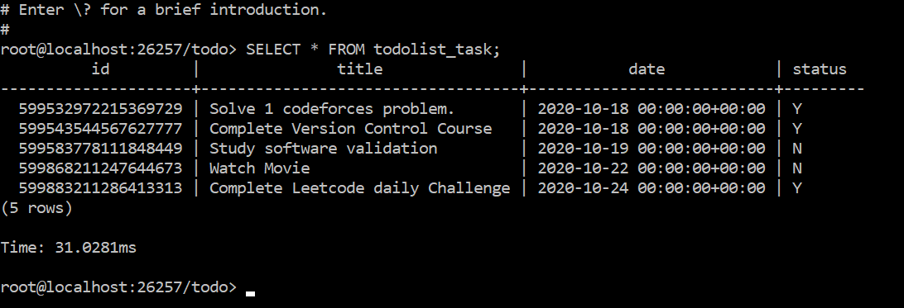

# Django TODo App
## Create a new single-node cluster
```
$mkdir certs my-safe-directory
$cockroach cert create-ca --certs-dir=certs --ca-key=my-safe-directory/ca.key
$cockroach cert create-node localhost $(hostname) --certs-dir=certs --ca-key=my-safe-directory/ca.key
$cockroach cert create-client root --certs-dir=certs --ca-key=my-safe-directory/ca.key
$cockroach start-single-node --certs-dir=certs --listen-addr=localhost:26257 --http-addr=localhost:8080 
```
## Create Database
```
$cockroach sql --certs-dir=certs --host=localhost:26257

>CREATE USER IF NOT EXISTS django;

>CREATE DATABASE todo;

>GRANT ALL ON DATABASE todo TO django;

$cockroach cert create-client django --certs-dir=certs --ca-key=my-safe-directory/ca.key
```

## Restart Cluster

```
>cockroach start --certs-dir=certs --listen-addr=localhost:26257 --http-addr=localhost:8080 --join=localhost:26257,localhost:26258,localhost:26259
```

## Creating the App

1. Start a new project on Django.<br>
2. Create new apps as required.<br>
3. Create model class and run migrations.<br>
4. Add forms for user interaction.<br>


## Web App Screenshots

### Home Page

 
 
 ### New Task
 
  
  
 ### Update Task
  
   

 ## Check Database

 ```
 >python manage.py dbshell

 >SHOW TABLES;

 >SELECT * FROM todolist_task;
 ```
 
 
