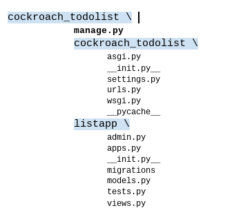
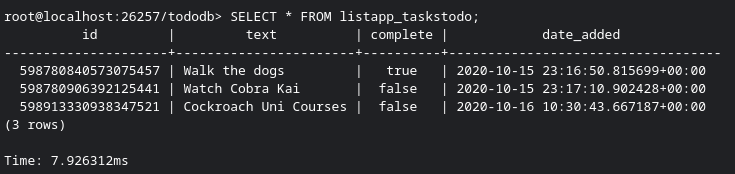
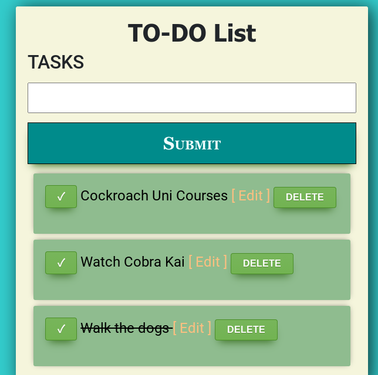

# Django TO-DO LIST app
   


# The Challenge  


Build a To-Do app using CockroachDB and a language/ORM of your choice!  


# Instructions   

### 1. Install CockroachDB     

To install CockroachDB go to [Cockroach Labs' webpage](https://www.cockroachlabs.com/docs/v20.1/install-cockroachdb-mac) and follow the instructions.   


### 2. Start a local CockroachDB cluster 

Go to [Cockroach Lab's webpage](https://www.cockroachlabs.com/docs/v20.1/start-a-local-cluster) to learn how to start up an insecure local cluster.    


### 3. Install Django and the CockroachDB backend for Django  


<details><summary> <b> Click for more details </b> </summary>
<p>


1.  Set up and activate a  virtual environment: 
    ```shell
    python3.8 -m venv <name>
    source <name>/bin/activate
    ```
1. Install Django: 
    ```shell
    python3.8 -m pip install django==3.0.*
    ```
1. Install one of the `psycopg2` prerequesites ( [psycopg2-binary](https://pypi.org/project/psycopg2-binary/) for this project)  

1. Install the **CockroachDB Django backend**: 
    ```shell
    python -m pip install django-cockroachdb==3.0.*
    ```  


</p>
</details>   


### 4. Create the `django` user and `tododb` database 
1. Open a **SQL Shell**: 
    ```shell 
    cockroach sql --insecure --host=localhost:26257
    ```

    >Make sure your CockroachDB cluster is running before you open the SQL Shell

1. In the **SQL Shell** enter the following commands: 
    ```sql
    CREATE USER IF NOT EXISTS django;  

    CREATE DATABASE tododb;   

    GRANT ALL ON DATABASE tododb TO django;  

    \q
    ``` 
    
   

### 5. Create a Django project  

1. Run the following command to create a new project: cockroach_todolist for this to-do app. 

    ```shell
    django-admin startproject cockroach_todolist
    ``` 
    
This creates a `cockroach_todolist` directory. Inside this directory there is a subdirectory `cockroach_todolist` and a `manage.py` file. 

2. Open the `settings.py` file in `cockroach_todolist/cockroach_todolist` and make some modifications:  
+  `ALLOWED_HOSTS`: 

    ```python
    ALLOWED_HOSTS = ['0.0.0.0']
    ```  

+ DATABASES:  

    ```python
    DATABASES = {
        'default': {
            'ENGINE': 'django_cockroachdb',
            'NAME': 'tododb',
            'USER': 'django',
            'HOST': 'localhost',
            'PORT': '26257',
        }
    }
    ``` 


### 6. Create the Django App (Web application)
1. Open the `cockroach_todolist` directory that contains manage.py 

2. Run the following command:
    ```shell
     python manage.py startapp listapp
    ```    


This creates a `listapp` directory in the outer `coackroach_todolist` directory.  

<details><summary> <b> Click for more details </b> </summary> <p>

The project and app directories now look like this:   


</p>
</details>   


 
3. Go to `cockroach_todolist/cockroach_todolist` and modify the `settings.py` file. Add **listapp** to the INSTALLED_APPS list:   

    ```shell

    INSTALLED_APPS = [
        'django.contrib.admin',
        'django.contrib.auth',
        'django.contrib.contenttypes',
        'django.contrib.sessions',
        'django.contrib.messages',
        'django.contrib.staticfiles',
        'listapp'
    ]  
    ```
4. Go to the outer `cockroach_todolist` directory (where you can find the manage.py file) and enter the following: 
    
    ```shell
     python manage.py migrate 
      ```


### 7. Write the application logic

To build the web app follow these steps: 
+ Define the model for the app in `cockroach_todolist/listapp/models.py` 
+ Define the URLs needed for the project:    
    +   Open the urls.py file in `cockroach_todolist/cockroach_todolist` and modify it to include the urls needed for the app.   


    ```python
    urlpatterns = [
    path('admin/', admin.site.urls),
    path('', include('listapp.urls'))
    ]
     ```  

     + Create a urls.py file in `cockroach_tolist/listapp` and add the paths to the views.

+ Open the views.py file in cockroach_todolist/listapp and write the code for your views. 
+ Create a forms.py file in cockroach_todolist/listapp and add the code for the forms. 

+ Define the templates:   
    + Create a `templates` directory in `listapp`. Inside templates create another directory called `listapp`.  
    The path to the files looks like this:  

    ```shell  
    cockroach_todolist/listapp/templates/listapp
    ```  

    + Inside create the following files: `indexapp.html`, `edit.html`

   
### 8. Set up the app 

1. Go to the `cockroach_todolist` directory where you can finde manage.py. Save the changes to the database:  
    ```bash
    python manage.py makemigrations listapp 

    python manage.py migrate
    ```    
2. Make sure that the database is set up properly:  

    1. Open a **SQL Shell** (check that the cluster is running): 
        ```shell
        cockroach sql --insecure --host=localhost:26257
        ```     
    2. Enter the following commands:


        ```sql
       USE tododb;   

       SHOW TABLES;  

       \q

        ```


### 9. Run the app  


#### **1.  From the command line using the SQL Shell**  
1. Repeat step 2 from [Set up the app](#Set_up_the_app ) 
2. Add data to the table using `INSERT` statements:    

    ```sql
    SELECT * FROM listapp_taskstodo; 

    INSERT INTO listapp_taskstodo (text, complete, date_added) VALUES ('Cockroach Uni Courses', 'False', NOW()); 

    SELECT * FROM listapp_taskstodo;  
    ```


2. Retrieve information from the table using `SELECT` statements: 

    ```sql
    SELECT * FROM listapp_taskstodo; 

    SELECT text FROM listapp_taskstodo; 

    SELECT text FROM listapp_taskstodo ORDER BY date_added DESC;
    ```   
    
    
    


#### **2. Web Application**    
1. In the terminal go to the outer `cockroach_todolist` directory (where you can see manage.py)  
2. Enter the following command:
    ```bash
    python manage.py runserver 0.0.0.0:8000
    ```  
3. Open browser and paste http://0.0.0.0:8000/  

4. Start using the app!!   

 


[](https://twitter.com/Caro_Oviedo_)

****** 


   Copyright [2020] [Carolina Oviedo]

   Licensed under the Apache License, Version 2.0 